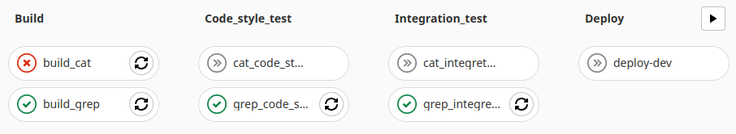

# CICD_GitLab

В данном проекте реализован пайплайн для сборки, тестирования и доставки утилит `cat` и `grep` на базе платформы *GiLab CI*. \
Работа *gitlab-runner* настроена на выполнение в оболочке `shell` \
По результатам прохождения этапов пайплайна реализована система оповещения. Оповещение производится с помощью бота в *Telegram*

#### Этапы пайплайна:
- CI
    - Сборка утилит из исходников
    - Тест кода на стиль *clang-format*
    - Интеграционное тестирование
- CD
    - Деплой в продакшн

#### Графический вид пайплайна:
  

#### Файлы проекта:
Файл с кодом пайплайна: `.gitlab-ci.yml` \
Скрипт для выполнения деплоя: `deploy_script.sh` \
Скрипт для оповещения о результатах прохождения этапов пайплайна: `telbot_script.sh` \
Директория с исходными файлами утилит *my_cat* и *my_grep*: `SimpleBashUtils`

### Пример работы пайплайна

- Успешное прохождение этапов *CI/CD*. Вид пайплайна: \
  

- Успешное прохождение этапов *CI/CD*. Логи \
  

- Ошибка сборки *my_cat*. Вид пайплайна: \
  

- Ошибка сборки *my_cat*. Логи: \
  

- Ошибка сборки *my_grep*. Вид пайплайна: \
  

- Ошибка сборки *my_grep*. Логи: \
  

- Ошибка стиля *my_cat*. Вид пайплайна: \
  

- Ошибка стиля *my_cat*. Логи: \
  

- Ошибка стиля *my_grep*. Вид пайплайна: \
  

- Ошибка стиля *my_grep*. Логи: \
  

- Ошибка функционала *my_cat*. Вид пайплайна: \
  

- Ошибка функционала *my_cat*. Логи: \
  

- Ошибка функционала *my_grep*. Вид пайплайна: \
  

- Ошибка функционала *my_grep*. Логи: \
  

- Ошибка деплоя (отсутствует связь с местом развертывания). Вид пайплайна: \
  

- Ошибка деплоя. Логи: \
  
